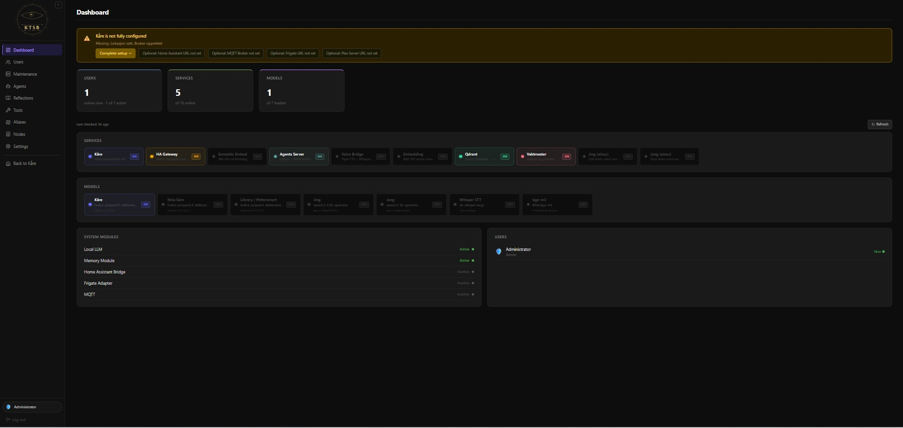

# Kåre The Smart Butler


[](https://buymeacoffee.com/dursnif)

**The AI layer your smart home is missing.**

> Frigate watches your cameras. Home Assistant controls your devices. KTSB is the intelligence that ties them together — running entirely on your own hardware, with no cloud required.

---

## Why does this exist?

If you run a smart home with Home Assistant and Frigate, you have probably noticed something: adding AI to the mix destroys the machine it runs on.

It makes sense when you think about it. Home Assistant is an I/O powerhouse — juggling hundreds of sensors, automations, and integrations all day. Frigate is doing real-time video processing for every camera on your property. Neither of them has spare capacity for a large language model. No matter how powerful the hardware you buy, cramming all three onto one machine is a death sentence.

**KTSB is the third piece.** It runs on its own dedicated machine — even a mid-range mini PC works — connects to your existing Home Assistant and Frigate installs, and handles everything AI-related:

- Understanding what you say in natural language
- Controlling your smart home through Home Assistant
- Analysing camera footage through Frigate
- Answering questions, setting timers, searching the web
- Remembering your preferences and conversations over time

Each system stays focused on what it does best.



---

## What can Kåre do?

### Talk and understand
Ask Kåre anything in natural language — by voice or text. No rigid commands, no keyword memorisation. *"Turn off everything downstairs and lock the door"* works just as well as *"lock front door"*.

The GUI supports **Norwegian, English, and German**. The assistant name, hot-word, and response language are all configurable.

### Control your smart home
Kåre connects to Home Assistant and can control anything HA knows about: lights, locks, thermostats, covers, media players, scenes, and scripts. You define your own room names and device nicknames so you can say *"the lamp in the corner of the bedroom"* and Kåre knows exactly what you mean.

### See through your cameras
Ask *"is there anyone outside?"* or *"what happened at the front door in the last hour?"* and Kåre checks your Frigate cameras and describes what it sees. Motion events and snapshots can be analysed automatically and announced over your speakers.

### Remember and learn
Kåre maintains a short-term memory of your recent conversations and a long-term memory that persists across sessions. It builds a self-image over time based on its interactions — the longer you use it, the better it knows you.

### A team of AI assistants
Behind the scenes, Kåre has a small team working alongside it:

- **Miss Kåre** — a quiet evaluator who reviews Kåre's answers before they reach you
- **Mechanic** — a technical assistant for deep-dives, system inspection, and complex problems
- **Miss Library** — searches a local Wikipedia corpus and the web for factual answers
- **Jing and Jang** — background inner voices that process and reflect while you are not watching

Every night at 04:00 they hold a reflection meeting to review the day. At 05:30 a developer meeting investigates any system issues. All of this happens quietly while you sleep.

### Multi-user with proper access control
Create separate accounts for everyone in your household. Each user gets a PIN, a role (Child, Teen, Adult, Admin), and their own memory and conversation history. Sensitive tools — web search, system inspection, camera access — are gated by role.

Remote access via WireGuard VPN is built in, with per-user access levels: local only, AI chat only, or full smart home access from anywhere.

### Flexible AI backend
Kåre uses **Ollama** for local LLM inference out of the box. No cloud account required. If you have a capable GPU, models run fast and privately on your own hardware. If you do not have a GPU, or want a more powerful model for complex reasoning, you can connect any OpenAI-compatible provider: OpenAI, NVIDIA NIM, vLLM, HuggingFace, or others.

---

## What you need

Kåre runs via **Docker**, which means it works on Linux, Windows, and macOS without installing anything else manually.

| | Minimum | Recommended |
|---|---|---|
| **OS** | Linux, Windows 10/11, macOS | Linux (native Docker, fastest) |
| **RAM** | 8 GB | 16 GB+ |
| **Disk** | 20 GB free | 60 GB+ (for AI models) |
| **GPU** | Not required | NVIDIA with 8 GB+ VRAM |

**No GPU?** Kåre still works fully. Connect a cloud LLM provider (like OpenAI) in Settings, or run small models on CPU — slower but functional.

**No Home Assistant or Frigate?** That is fine too. Kåre works as a standalone AI assistant and you can add integrations whenever you are ready.

---

## Getting started

### Step 1 — Install Docker

Docker is a tool that packages software into self-contained boxes that run the same way on any computer. You do not need to install Python, databases, or any other programming tools — Docker handles all of it.

**Windows:** Download and install [Docker Desktop](https://www.docker.com/products/docker-desktop/). During installation it will ask you to enable WSL 2 — say yes. Restart your computer when prompted. Open Docker Desktop once before continuing.

**macOS:** Download and install [Docker Desktop](https://www.docker.com/products/docker-desktop/). Open it once to finish setup.

**Linux:** Follow the [Docker Engine install guide](https://docs.docker.com/engine/install/) for your distribution. For NVIDIA GPU support, also install the [NVIDIA Container Toolkit](https://docs.nvidia.com/datacenter/cloud-native/container-toolkit/install-guide.html).

Verify Docker is working by opening a terminal and running:
```
docker --version
```
You should see a version number. If you get an error, make sure Docker Desktop is open and running.

---

### Step 2 — Download KTSB

Open a terminal — **PowerShell** on Windows, **Terminal** on Mac or Linux — and run:

```bash
git clone https://github.com/Dursnif/KTSB.git
cd KTSB
```

> **No git?** You can also [download the ZIP](https://github.com/Dursnif/KTSB/archive/refs/heads/main.zip) from GitHub and unzip it. Then open a terminal inside the unzipped folder.

---

### Step 3 — Start KTSB

**Linux / macOS:**
```bash
cp .env.example .env
docker compose up -d
```

**Windows (PowerShell):**
```powershell
copy .env.example .env
docker compose up -d
```

The first start downloads the Docker images (about 5 GB). This takes a few minutes depending on your internet speed. You only need to do this once — future starts are instant.

Watch the progress:
```bash
docker compose logs -f
```
Press `Ctrl+C` to stop watching logs. The services keep running in the background.

---

### Step 4 — Open the browser

Go to **http://localhost:5173/login** in your web browser.

Log in with the default admin credentials:

| Username | PIN |
|----------|-----|
| `admin` | `1234` |

> ⚠️ **You will be forced to change the PIN on first login.** Do not skip this — the default PIN is public knowledge.

The onboarding wizard walks you through the rest — no config files to edit manually:

1. **Profile** — your assistant's name, language, timezone, and location (used for weather)
2. **User** — create your admin account with a PIN
3. **Distribution** — choose how much of the system to enable (start with *Medium*)
4. **Integrations** — connect Home Assistant, Frigate, and others (you can skip this and do it later)
5. **Done** — install your first AI model and start chatting

---

## Connecting Home Assistant

In the KTSB admin panel, go to **Settings → Home Assistant**.

You need two things from your Home Assistant install:

**1. The URL** — the address you use to open HA in your browser. Usually something like `http://homeassistant.local:8123` or `http://192.168.1.x:8123`.

**2. A long-lived access token** — this gives KTSB permission to control HA on your behalf.

To create one: in Home Assistant, click your profile picture in the bottom-left corner → **Security** → scroll down to **Long-lived access tokens** → **Create token** → give it a name like *KTSB* → copy it and save it somewhere safe.

Paste the URL and token into **Settings → Home Assistant** in KTSB and save. That is it.

**Setting up device names** — Kåre understands room names and device nicknames you define yourself. Go to **Settings → Aliases** to map your own names (like *"the bedroom lamp"*) to Home Assistant entity IDs. The alias editor has a search function to help you find the right entity.

---

## Connecting Frigate

In KTSB admin, go to **Settings → Integrations → Frigate**.

You need:
- **Frigate URL** — the address of your Frigate instance (e.g. `http://192.168.1.x:5000`)

For real-time motion event detection, also connect **MQTT** under **Settings → MQTT** with your broker address and credentials. This lets Kåre react to Frigate events as they happen.

Go to **Settings → Cameras** to configure which cameras Kåre should monitor, what objects to watch for (people, cars, animals), confidence thresholds, and whether to announce detections over your speakers.

---

## Choosing an AI model

After the onboarding wizard, go to **Settings → LLM → Manage models** to pull an AI model. No command line needed — search by name, click Pull, and wait.

| Your GPU VRAM | Recommended model | Notes |
|---|---|---|
| No GPU | `qwen2.5:3b` | Slow on CPU, but works |
| 6–8 GB | `qwen2.5:7b` | Good everyday balance |
| 12–16 GB | `qwen3:8b` | Better reasoning, recommended |
| 24 GB+ | `qwen3:14b` or larger | Best results |

Start by setting the same model for all roles (Kåre, Miss Kåre, Library, Mechanic) — this uses less VRAM and keeps things simple. You can give each agent its own model later once you are comfortable.

**Qwen3 models** support extended thinking — Kåre pauses to reason before answering complex questions. Enable it per role under **Settings → LLM**.

**Prefer cloud?** Go to **Settings → LLM → Cloud** and enter an API key for OpenAI, NVIDIA NIM, or another OpenAI-compatible provider.

---

## Voice input

Browsers require HTTPS for microphone access. For voice input to work, Kåre needs to be served over HTTPS.

Kåre includes **Caddy**, which obtains a free Let's Encrypt certificate automatically. You will need a free dynamic DNS hostname from [DuckDNS](https://www.duckdns.org/).

1. Create a free account at [DuckDNS](https://www.duckdns.org/) and register a subdomain — e.g. `mykaare.duckdns.org`
2. Set it to point to your home's public IP address (shown on the DuckDNS dashboard)
3. Open ports **80** and **443** in your router (search for *port forwarding* in your router's manual)
4. Open your `.env` file and set `KAARE_DOMAIN=mykaare.duckdns.org`
5. Restart: `docker compose up -d`

Voice input will work as soon as the certificate is issued — usually within 30 seconds of first start.

Access Kåre at `https://mykaare.duckdns.org` from any device on your network or over VPN.

> For local use without voice, the default `KAARE_DOMAIN=localhost` works fine.

---

## Service profiles

Set `COMPOSE_PROFILES` in your `.env` file to control which optional services start:

| Value | What starts | When to use |
|---|---|---|
| *(empty)* | Core only (API, GUI, agents, intent) | Cloud LLM or quick test |
| `medium` | + Semantic memory and wiki search | Recommended for most installs |
| `full` | + Voice bridge (speech-to-text, text-to-speech) | When you want voice input and output |

```
# .env
COMPOSE_PROFILES=medium
```

---

## Updating

```bash
docker compose pull
docker compose up -d
```

Your configuration, state, and data are stored in folders outside the Docker images and survive updates unchanged.

---

## Your data stays home

Everything in KTSB runs on your own hardware by default. No data leaves your network unless you explicitly configure a cloud LLM provider. Conversations, memories, camera snapshots, and user data stay on your machine.

---

## For developers

Code-mounted mode — edit files on disk without rebuilding images:

```bash
docker compose -f docker-compose.yml -f docker-compose.dev.yml up -d
```

Edit a Python file → `docker compose restart kaare-api` (~5 seconds) → done.

---

## Project layout

```
configs/        ← All configuration (YAML + .env secrets)
state/          ← Runtime state (memory, timers, Qdrant snapshots)
data/           ← SQLite databases (users, long-term memory)
logs/           ← Service logs
kaare_core/     ← Shared Python library
services/       ← Embedding, voice, agents
frontend/       ← React/Vite GUI (TypeScript)
```

---

## License

[MIT](LICENSE)
